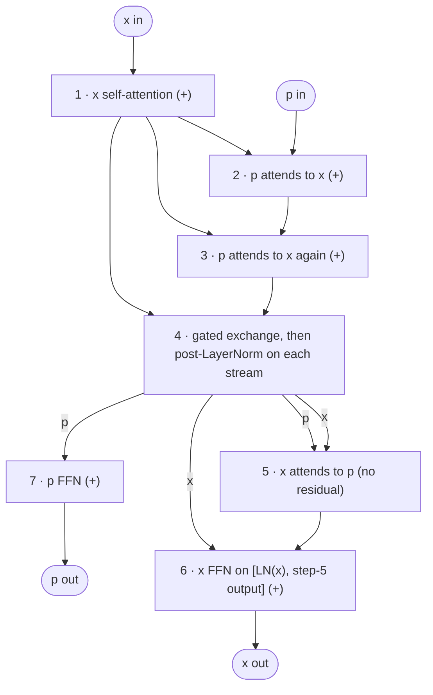

# Think-Pad

**A dual-stream transformer language model, compared with a standard GPT at matched parameters and matched training compute.**

Think-Pad adds a second residual stream, the *pad* (`p`), next to the usual token stream (`x`). The pad starts at zero, repeatedly reads from `x` through cross-attention, exchanges information with `x` through learned gates, and is the stream the next-token prediction is made from. The question this repo tests is whether giving a model a separate stream to "work things out" in improves language modeling at the same cost.


## Results

> **TODO:** fill in from `runs/*/results.json` and regenerate the figure with `python -m thinkpad.plot`.

Both models were trained on WikiText-103 with the GPT-2 tokenizer, a 512-token context, and the same optimizer and schedule.

| Model | Params | Non-embedding params | Train FLOPs | Steps | Val loss | Test loss | Test ppl |
|---|---|---|---|---|---|---|---|
| Baseline GPT (13 × 512) | 66.9 M | 40.9 M | 1.44e17 | 10,000 | – | – | – |
| Baseline GPT, compute-matched | 66.9 M | 40.9 M | 1.50e17 | 10,353 | – | – | – |
| Think-Pad (8 × 384) | 64.1 M | 44.6 M | 1.50e17 | 10,000 | – | – | – |

<!-- Uncomment once the figure exists:

-->

## How a Think-Pad block works



`(+)` marks a pre-norm residual update. Step 4 is `x ← LN(x + g·p + (1−g)·x)` with a per-channel gate `g = σ(W[x; p])`, and the mirror image for `p`; both gates read the streams as they were before the exchange.

All attention is causal, including cross-stream attention: both streams index the same token positions, so position *t* of one stream only reads positions ≤ *t* of the other. `tests/test_model.py::test_is_causal` checks this directly.

The baseline is a standard pre-norm GPT (fused QKV, GELU MLP, learned positions, tied input/output embeddings). Its 13 layers were chosen to bring its parameter count close to Think-Pad's.

## How compute is counted

Think-Pad does more attention per parameter than a GPT, so equal parameters does not mean equal cost. Training compute is counted as:

```latex
\text{FLOPs per step} = 3 \times B \times T \times \left( 2 N_{\text{matmul}} + 4\, n_{\text{attn}}\, T\, d \right)
```

`N_matmul` is the number of weights in every linear layer, including the tied output layer, which still does a full matrix multiply. `n_attn` is the number of attention operations (4 per Think-Pad block, 3 in the last; 1 per GPT block). `d` is the model width. The factor 3 is forward plus a backward pass that costs twice the forward.

This follows the usual convention: matrix multiplies only, one multiply-add = 2 FLOPs, attention counted as dense. `tests/test_flops.py` checks the formula against PyTorch's own `FlopCounterMode` count, and they match exactly.

The `6N` rule of thumb (N = non-embedding parameters) undercounts these small models by about 40%. With a 50k vocabulary, the output layer is a large share of the compute but isn't in `N`.

```
$ python -m thinkpad.flops
thinkpad:
  parameters                 64.09 M
  non-embedding params       44.60 M
  train FLOPs / token        456.1 M
  (6N rule of thumb)         267.6 M
  train FLOPs / step      1.495e+13  (batch 64)
  10,000 steps           1.495e+17
baseline:
  parameters                 66.92 M
  non-embedding params       40.92 M
  train FLOPs / token        440.7 M
  (6N rule of thumb)         245.5 M
  train FLOPs / step      1.444e+13  (batch 64)
  10,000 steps           1.444e+17
```

Think-Pad costs about 3.5% more per step. To compare at equal compute, give the baseline the same budget with `--flops_budget 1.495e17`, which works out to 10,353 steps.

## Quickstart

```bash
git clone https://github.com/IanPrice17/Asymmetric-Model. think-pad
cd think-pad
pip install -e ".[dev]"

pytest -q                                   # ~1.5 min on CPU
python -m thinkpad.flops                    # parameter and FLOPs summary

python -m thinkpad.train --arch thinkpad --out_dir runs/thinkpad
python -m thinkpad.train --arch baseline --out_dir runs/baseline
python -m thinkpad.train --arch baseline --out_dir runs/baseline-matched --flops_budget 1.495e17

python -m thinkpad.plot runs/thinkpad runs/baseline-matched --out assets/val_loss_vs_flops.png
python -m thinkpad.sample runs/thinkpad/best_model.pt --prompt "The history of"
```

The first training run downloads WikiText-103 and tokenizes it into `data/wikitext103/` (about 500 MB to download). Every config field can be overridden from the command line; see `python -m thinkpad.train --help`. Use `--arch thinkpad-tiny` for a quick CPU run.

### On Google Colab (A100)

```python
from google.colab import drive
drive.mount("/content/drive")

!git clone https://github.com/IanPrice17/Asymmetric-Model. think-pad
%cd think-pad
!pip install -q tiktoken datasets

!python -m thinkpad.train --arch thinkpad \
    --data_dir /content/drive/MyDrive/think-pad/data \
    --out_dir  /content/drive/MyDrive/think-pad/runs/thinkpad
```

Keeping `--data_dir` and `--out_dir` on Drive means a disconnected session resumes where it stopped: run the same command again. A run directory is tied to one model config; resuming with a different config is refused, so runs can't overwrite each other.

## What a run writes

| File | Contents |
|---|---|
| `config.json` | Model and training config, step count, FLOPs per step |
| `metrics.jsonl` | Train loss every `log_interval` steps; train and validation loss at every eval, with tokens and FLOPs so far |
| `checkpoint.pt` | Latest model, optimizer and RNG state, for resuming |
| `best_model.pt` | Weights with the lowest validation loss |
| `results.json` | Validation and test loss and perplexity of `best_model.pt` |
| `sample.txt` | Text generated from `best_model.pt` |

Validation loss is computed exactly over the whole validation split, in non-overlapping 512-token windows, not estimated from random batches. Because each window starts with no context, perplexities are slightly higher than a sliding-window evaluation would give. Test loss is computed once, at the end, for the best checkpoint.

## Repository layout

```
thinkpad/
  config.py     model presets and training config
  model.py      ThinkPadGPT and BaselineGPT
  data.py       WikiText-103 tokenization and batching
  flops.py      analytic and measured FLOPs
  train.py      training loop and CLI
  sample.py     text generation from a checkpoint
  plot.py       validation loss vs. compute figure
tests/          pytest suite (runs on CPU in CI)
```

## Notes

- **Checks against the original code.** This repo is a cleanup of the notebooks the experiments started in. `tests/test_equivalence.py` loads weights from a verbatim copy of the original architecture code and checks that logits, loss and every gradient are identical. Checkpoints saved by the original notebooks load with `python -m thinkpad.sample <path> --arch thinkpad`.
- **Unused layers removed.** In the original code, the last block also computed steps 4–6 for `x`. The prediction is read from `p`, and nothing flows from `x` back to `p` after step 4, so those layers (about 2.7 M parameters) never received a gradient. They're no longer built. The function the model computes is unchanged; the reported parameter count is the honest one, 64.1 M rather than 66.75 M.
- **The pad starts empty.** Because `p = 0` entering block 0, its first read of `x` uses the same query at every position until training moves LayerNorm's bias, and that LayerNorm's scale never receives a gradient. This is harmless, but it is an interesting thing to vary, for example with a learned initial pad.
- **Several epochs.** 10,000 steps × 64 × 512 tokens is more than one pass over WikiText-103's training set; `train.py` prints the exact epoch count. Compare models on validation loss, not training loss.

## License

MIT
