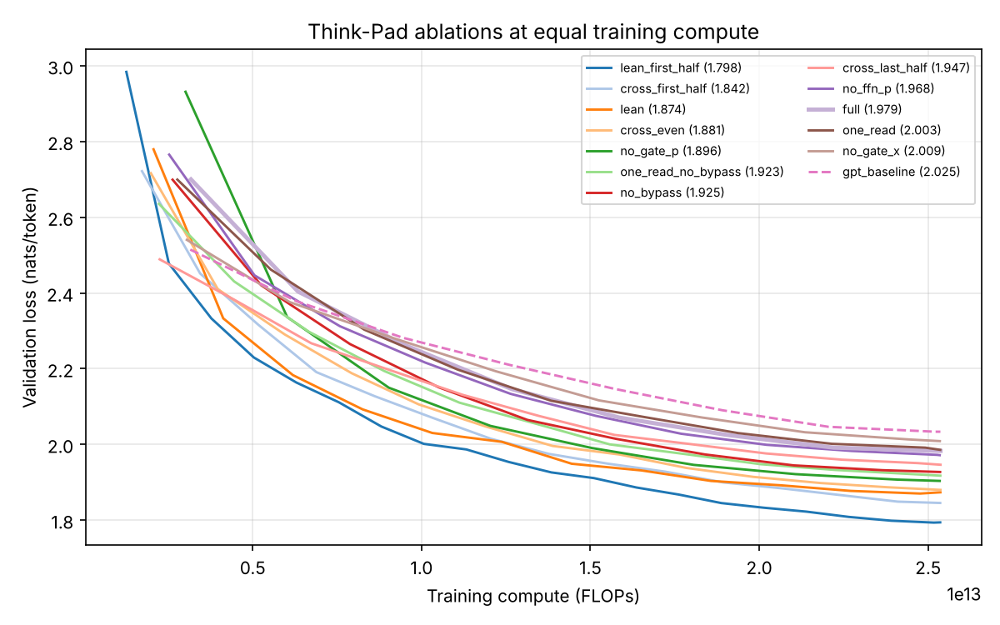
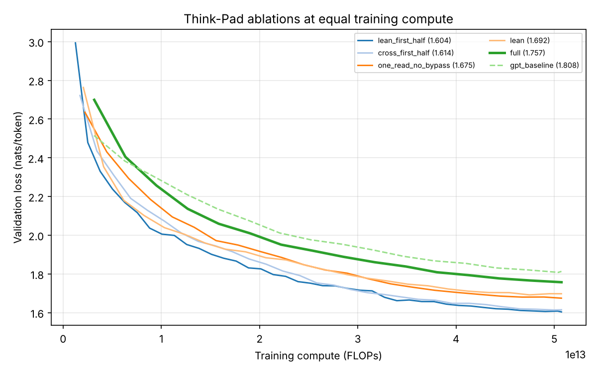
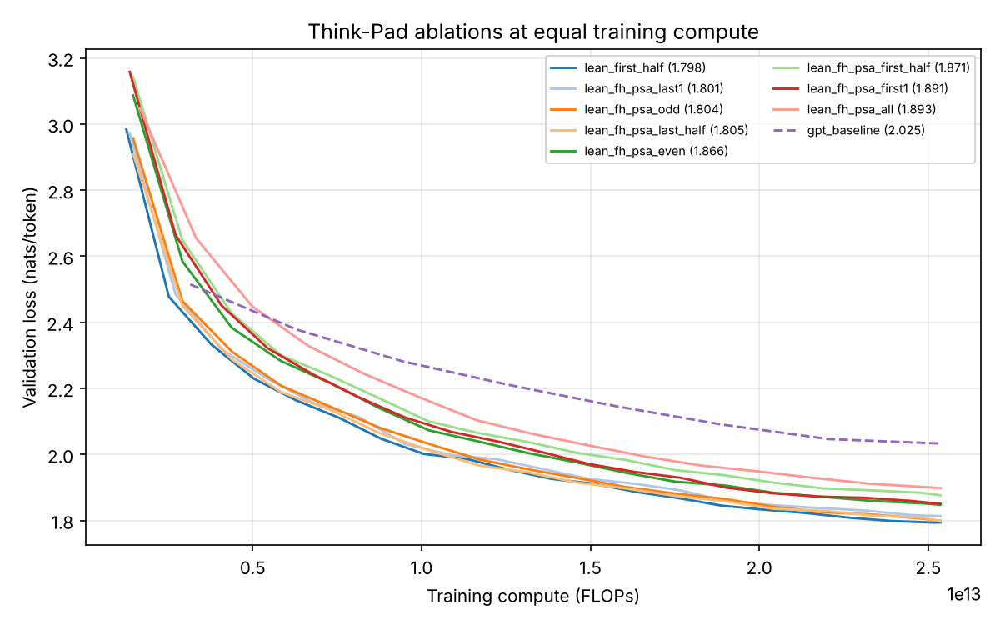

# Pilot ablations: Tiny Shakespeare, character level

**Result:** at equal training compute, cutting Think-Pad steps made the model better, and the leanest variant was best. A plain GPT shrunk to the same size did slightly better still. At this scale, most of the gain comes from a cheaper model getting more training steps, not from the dual-stream design. The one design result that held at equal size: the full Think-Pad beat an equal-size GPT.

This is a pilot. The models are tiny (1–2.4M parameters), the data is ~1M characters, and runs were done on 2 CPU cores. It shows which variants are worth running at full size on WikiText-103, not what will happen there.

## Setup

| | |
|---|---|
| Data | Tiny Shakespeare, characters (65 symbols), 90/5/5 split |
| Think-Pad | `thinkpad-char`: 4 layers, width 128, 4 heads, context 64, dropout 0.1 |
| GPT | `baseline-char`: 12 layers, width 128 (same size as the full Think-Pad); size-matched control: 5 layers |
| Training | batch 32, AdamW, lr 1e-3 → 1e-4 cosine, 50 warmup steps, float32, CPU |
| Compute | every run gets the full Think-Pad's FLOPs for 800 steps (2.54e13 FLOPs), or 1,600 steps (2×) |
| Seeds | 2 at the 800-step budget (± = standard deviation), 1 at 2× |

Validation loss is in nats per character, over the whole validation split; lower is better.

## Every variant, 800-step budget

| Rank | Variant | What changed | Params (M) | Steps | Val loss | Δ vs full |
|---|---|---|---|---|---|---|
| 1 | lean_first_half | one read, no bypass, no x→p gate; remaining cross steps only in first half | 0.97 | 2,015 | 1.798 ± 0.006 | −0.181 |
| 2 | cross_first_half | steps 2–5 only in the first half of layers | 1.30 | 1,473 | 1.842 ± 0.005 | −0.137 |
| 3 | lean | one read, no bypass, no x→p gate | 1.56 | 1,229 | 1.874 ± 0.006 | −0.105 |
| 4 | cross_even | steps 2–5 only in even layers | 1.50 | 1,279 | 1.881 ± 0.001 | −0.098 |
| 5 | no_gate_p | no x→p gate (step 4, p side) | 2.22 | 842 | 1.896 ± 0.011 | −0.083 |
| 6 | one_read_no_bypass | no second read, no bypass (steps 3, 5) | 1.69 | 1,140 | 1.923 ± 0.008 | −0.056 |
| 7 | no_bypass | no bypass (step 5) | 1.96 | 965 | 1.925 ± 0.003 | −0.054 |
| 8 | cross_last_half | steps 2–5 only in the second half of layers | 1.69 | 1,130 | 1.947 ± 0.000 | −0.032 |
| 9 | no_ffn_p | no p FFN (step 7) | 1.83 | 1,003 | 1.968 ± 0.005 | −0.010 |
| 10 | full | all 7 steps | 2.35 | 800 | 1.979 ± 0.006 | 0 |
| 11 | one_read | no second read (step 3) | 2.09 | 916 | 2.003 ± 0.024 | +0.024 |
| 12 | no_gate_x | no p→x gate (step 4, x side) | 2.25 | 831 | 2.009 ± 0.000 | +0.030 |
| 13 | GPT, 12 layers | plain GPT, same size as full | 2.38 | 805 | 2.025 ± 0.012 | +0.046 |
| – | GPT, 5 layers | plain GPT, same size as lean_first_half | 1.00 | 1,923 | **1.759 ± 0.009** | −0.220 |



## Does it hold with more training? (2× budget, 1 seed)

| Variant | Params (M) | Steps | Val loss |
|---|---|---|---|
| GPT, 5 layers | 1.00 | 3,847 | **1.569** |
| lean_first_half | 0.97 | 4,031 | 1.604 |
| cross_first_half | 1.30 | 2,947 | 1.614 |
| one_read_no_bypass | 1.69 | 2,280 | 1.675 |
| lean | 1.56 | 2,458 | 1.692 |
| full | 2.35 | 1,600 | 1.757 |
| GPT, 12 layers | 2.38 | 1,610 | 1.808 |

The order is unchanged with twice the training, and the gaps shrink slightly.



## Adding self-attention to p (on lean_first_half)

**Result:** no placement beat lean_first_half without it. Self-attention in layer 0 cost about 0.07–0.09; anywhere else it roughly broke even.

p self-attention (`--sa_p`) runs after p reads x and before the step-4 gate, so in layers with a gate its output reaches x the same block. Same 800-step compute budget, 2 seeds.

| Rank | p self-attention in layers | Params (M) | Steps | Val loss | Δ vs none |
|---|---|---|---|---|---|
| 1 | none (lean_first_half) | 0.97 | 2,015 | 1.798 ± 0.006 | 0 |
| 2 | 3 (last only) | 1.04 | 1,866 | 1.801 ± 0.018 | +0.003 |
| 3 | 1, 3 (odd) | 1.10 | 1,737 | 1.804 ± 0.006 | +0.006 |
| 4 | 2, 3 (second half, the p-only layers) | 1.10 | 1,737 | 1.805 ± 0.008 | +0.007 |
| 5 | 0, 2 (even) | 1.10 | 1,737 | 1.866 ± 0.027 | +0.068 |
| 6 | 0, 1 (first half) | 1.10 | 1,737 | 1.871 ± 0.007 | +0.073 |
| 7 | 0 (first only) | 1.04 | 1,866 | 1.891 ± 0.057 | +0.093 |
| 8 | 0–3 (all) | 1.23 | 1,527 | 1.893 ± 0.007 | +0.095 |

- **Layer 0 is the problem.** Every placement that includes layer 0 is about 0.07–0.09 worse, and none of the others is. At layer 0, p has read x only once, starting from zero, so attending over its own earlier positions adds little, and its output then enters x through the gate.
- **Elsewhere it doesn't pay for itself.** Later placements land within noise of no self-attention, so the extra compute buys nothing at this scale.
- The size-matched 5-layer GPT (1.759) is still ahead of every variant here.



## What it means

- **Cost dominates at this scale.** The ranking mostly follows how many steps each variant could afford. Every run was still improving at the end, so cheaper models win.
- **Compare at equal size.** Full Think-Pad vs a same-size GPT: Think-Pad wins by 0.046 (and 0.051 at 2×). lean_first_half vs a same-size GPT: GPT wins by 0.039 (and 0.035 at 2×). The dual-stream design helped at 2.35M parameters but not at 1M.
- **Steps that did not pay for themselves:** the second read (3), the bypass (5) and the x→p gate (4, p side). Removing the x→p gate improved loss even though it barely changes the cost.
- **The step that did pay:** the p→x gate (4, x side). Removing it was the only single cut that made the model worse.
- **Where cross-stream steps go matters:** first half of layers beat second half by 0.105.
- lean_first_half has attention only in its first 2 layers; its last 2 layers are p-only FFNs, because nothing after layer 1 can reach the prediction through x.

## Next: full size on WikiText-103

The pilot can't tell whether these results hold when data isn't the bottleneck. On a GPU:

```bash
python -m thinkpad.ablate --out_root runs/ablate --steps 2500 \
    --only full one_read_no_bypass no_gate_p cross_first_half lean lean_first_half gpt_baseline
```

then the size-matched GPT controls (at full scale, GPT depth that matches each finalist's parameters):

| Finalist | Params | Size-matched GPT |
|---|---|---|
| lean_first_half | 38.1M | 4 layers (38.6M) |
| cross_first_half | 45.2M | 6 layers (44.9M) |
| lean | 48.7M | 7 layers (48.0M) |
| one_read_no_bypass | 51.1M | 8 layers (51.2M) |

```bash
for L in 4 6 7 8; do
  python -m thinkpad.ablate --out_root runs/ablate-gpt$L --steps 2500 --only gpt_baseline -- --n_layer $L
done
```

Each run trains at the full Think-Pad's compute for 2,500 steps (about 3.7e16 FLOPs), roughly a quarter of the original 10,000-step runs.
